# Dynacord DRS78

The Dynacord DRS-78 is a delay & reverb studio effect, released in 1978.
This unit is a digital effect which was, in that time quite ambitious. Previous delay/reverb units were mostly mechanical (plate reverbs, spring reverbs) or based on Bucket Brigade Chips (BDD delays).

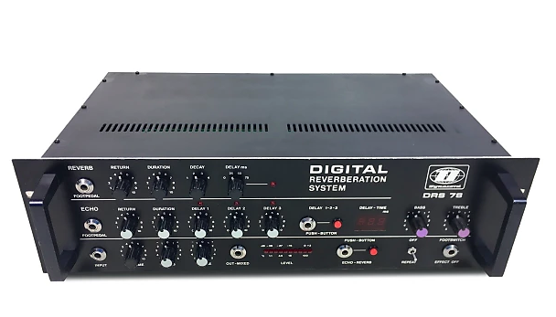

Digitalizing a signal, memorizing-it in very small memory chips and releasing it after a configurable delay, in real time, was quite challenging.

In comparison, Lexicon released its 224XL unit in 1979 and AMS the DMX 15-80 in 1978 (RMX-16 in 1981).
The Dynacord DRS78 with its 12bits conversion and 
300ms delay was top level technology.

So, why spend time and energy reversing this specific unit?
I own one of these and it's currently not working.

On this document I will try to reverse and explain how each board composing the unit works.
Hopefully, the schematics are part of the Service manual and are easily available [Dynacord-DRS-78-SERVICE-MANUAL.pdf](Dynacord-DRS-78-SERVICE-MANUAL.pdf).

## PSU (Bestückungsseite)

__Page:__ 30

__Purpose:__ This board delivers the tensions used everywhere else.

The PSU board generates:

  - +12V (to be used with digital ground)
  - +15V (to be used with analog ground)  
  - -15V (to be used with analog ground)  
  - -5V (to be used with analog ground)  
  - 2x +5V (to be used with digital ground)

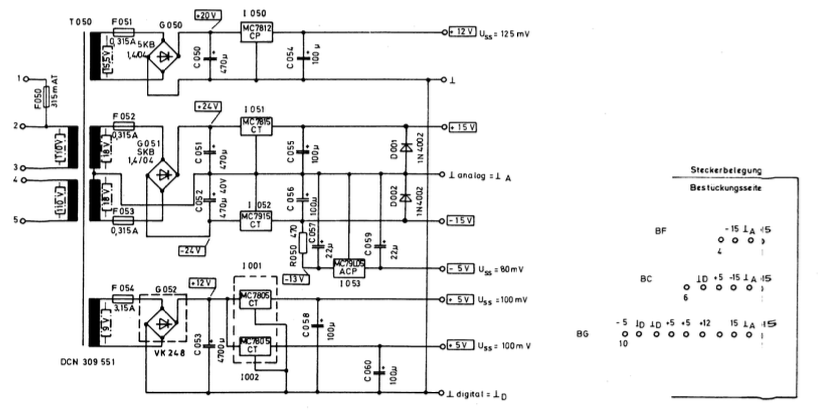

  We can see that +12V and +5V power rails are used only for all the digital logic and IC power supply.

  +/-15V are probably used for opamps and -5V use is unknown.

__Testing:__ First of all you should disconnect the connectors from the PSU, turn the unit on and test the expected tensions. If everything is fine, connect everything back.

## Back panel (86048)

__Page:__ 32/33

__Purpose:__ This board is at the back of the unit and handles most of the connections. 

The unit is a stereo delay/reverb but actually works internally in mono. Thus, the L/R entries are merged into mono then sent to the "Effect board" (front panel, left side). The wet signal (with the effect applied) is again in mono, so it has to be transformed into a stereo signal.
The interactions from this board to the others is quite simple: it sends the dry signal to the next stage (__EFF SEND__) and receives the wet signal (__EFF RETURN__). That's all.

This board handles the jack connectors: 

  - input mono: goes to BD pin 5 "input" and through a line driver then merged with input L/R
  - input left: goes through a line driver, is merged with R and sent to BD pin 1
  - input right: goes through a line driver, is merged with L and sent to BD pin 1
  - direct left: a copy of the input left signal, after the line driver 
  - direct right: a copy of the input right signal, after the line driver 
  - direct mono: a copy of the input left and right signal, after the line driver 
  - universal out: a merge from the input L/R after the line driver and the effect return from BD pin 8. The front panel shows this input jack (just a remote connector).
  - mixed mono: same as universal out
  - mixed left: a merge from input L after the line driver and the effect return from BD pin 8
  - mixed right: a merge from input R after the line driver and the effect return with inverted phase from BD pin 8
  - delay left: the effect return from BD pin 8
  - delay right: the effect return with inverted phase from BD pin 8
  - delay mono:  same as delay left

We see that direct output are copies of inputs, with a line driver.
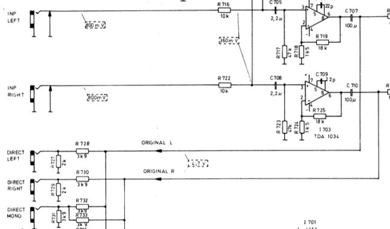

The delay/reverb is working in mono, thus L R signal are merged and sent to BD pin 1.
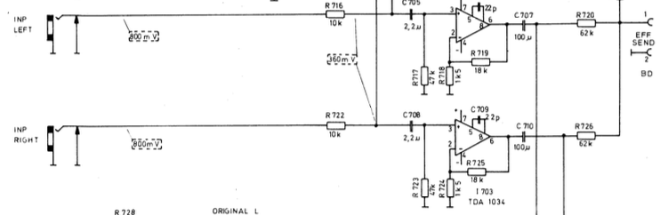

The wet signal comes as a mono signal from BD pin 8. In order to arrange a stereo signal, the right output channel is generated using a phase invertion (which seems to be a strange idea).
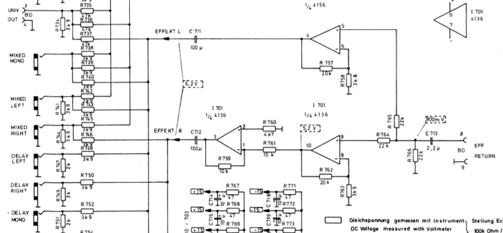

Dyn inp and Dyn out are simply specific connectors from the above inputs/outputs.

__Testing:__ Connect an audio source on the mono input of the unit. Check the "direct mono" output. If the signal is there, good news all the OpAmp on this board to the "Effect send" are fine.
Then check the BD connector PINs 1/2 to make sure you signal is still there.
Now make sure your wet signal is found on the connector BD 8/9. If it's there, also check the "delay mono" output.

## Carrier board (trägerplatine 86047)

__Page:__ 35/36

We don't have any schematic for this board.

## Display board (Anzeigeplatine 87028)

__Page:__ 36/37

__Purpose:__ The display board is the front right panel. It handles the display, a few knobs/connectors and the master delay clock.

The MC14538B  is monostable multivibrator. The clocks are delivered by PIN 7 and 9.
Those clocks are set using a capacitor and a resistor connected respectively on pins 1/2 and 14/15.

### Qb clock (__ERIMP__):

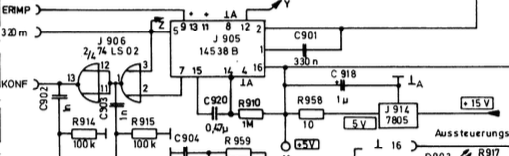

The B channel of MC14538B works as follow:
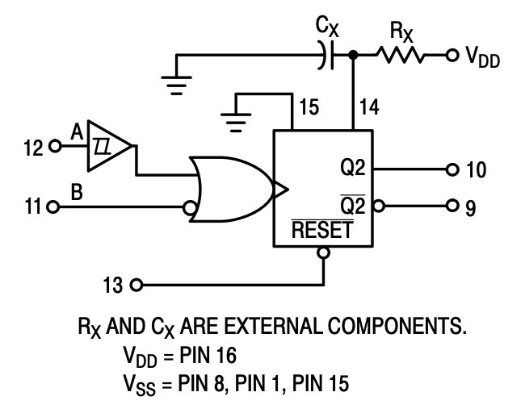

The Qb clock on PIN 9 (__ERIMP__) is fixed, since capacitor/resistor on pins 14/15 have fixed values.
The clock can be stopped/restored using __320 m__ on pin 5. In practive we can see that Qb delivers a 5V signal until the delay/reverb button is pressed. Thus, 0V is delivered until the button is released.

For Qb: 

    T = Rx . Cx = 1000000 . 0,00000047 = 0,47s

### Qa clock (__KONF__):

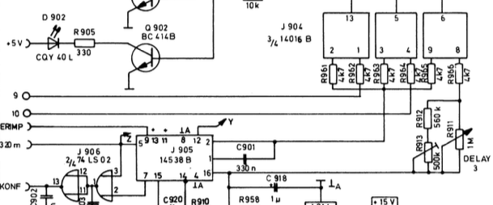

The A channel of MC14538B works as follow:
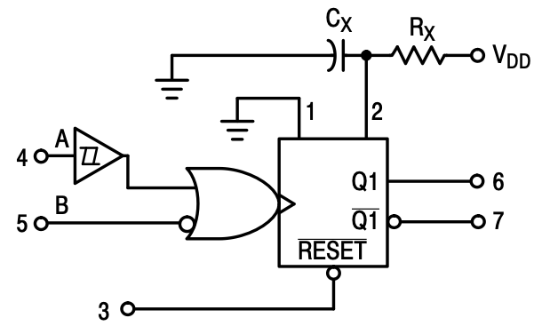

The Qa clock is controled by the capacitor and resistor connected on pins 1/2. While the capacitor is fixed, the resistor depends on the state of a series of flip flop switches.

When pushing the Delay 1-2-3 button, a set of flip flops and binary logic is used to drive a [HD14016B](HD14016B.PDF) (J905).
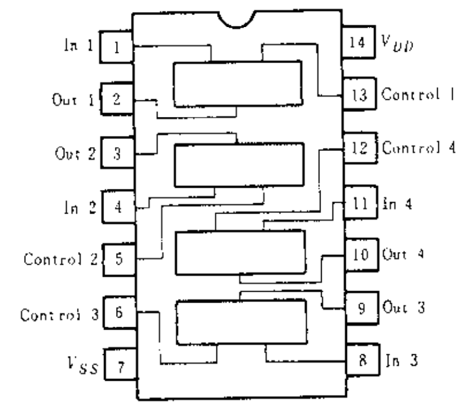
This analog switch will work as follow:

  - if control on pin 13 is set, input 1 (from left front board jumper 9) is sent to output 2
  - if control on pin 5 is set, input 4 (from left front board jumper 10) is sent to output 3
  - if control on pin 6 is set, input 8 (a tension regulated by Delay knob) is sent to output 9

Depending on the flip flop status, we pick the knob position for delay 1-2 (effect board) or 3 (display board).
All those 3 outputs (2/3/9) are merged and sent to MC14538B, pin 1/2 and thus used to control the oscillator speed on channel A. In pratice, only one of the 3 inputs is selected (delay 1/2/3 but not a mix of them). 

When delay is set to minimal value (007ms), the MC14538B Qa output (pin 6) show a 5V signal for 3ms every 343ms. 
When delay is set to maximal value (337ms), the MC14538B Qa output (pin 6) show a 5V signal for 150ms every 343ms. 

The Qa inverted used on the circuit shows the inverted signal. 

For Qa: T = Rx . Cx. Rx value depends on the Flip Flop state.

We can see that Qa is the current setting value, sent to the Konf output and the circuit in charge of controlling the display.

Qa output (pin 7) delivers a signal depending on the delay setting. It is ANDed with the 320m signal. If we check the resulting value (J906 pin 1) we can see that the the square signal duration is half the value of the setting (100ms delay will have a 50ms square signal).
Before being sent to the __KONF__ output, the signal is inverted (J906 pin 13).

TODO: Tout ce qui vient de BE (320m notamment) a plein de bruit et fout le boxon.

TODO: It looks as if the two first analog switches will deliver 2*4k7 ohm values when the configurable one on the right will depend on the knob position. Thus, how does recall works? 

### Switching from reverb to delay mode 

The MC14027B (J910) is a flip flop, receiving a clock from the __SYR__ pin (BE pin 9).
When the Reverb/Delay button is pressed, it seems to drive the __EREV__ output flag (BE pin 13), that should probably set to 0V on Reverb mode and 5V on Delay ("E" prefix may be "inverted")

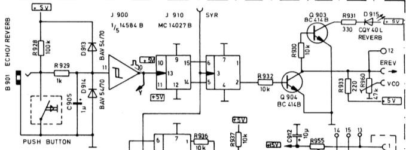

### Repeat

The Repeat button is using a set of flip flop and will export an on/off boolean on output __REP__ (BE pin 7):

  - 0V repeat off 
  - 5V repeat on.

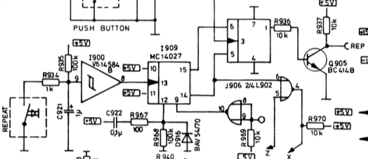

### EQ

The front panel also hosts the main uniq EQ (bottom right of the schematic).
This is a simple EQ circuit, built around a few OpAmps, 2 knobs and having __EKL IN__ as input and __EKL OUT__ as output. 

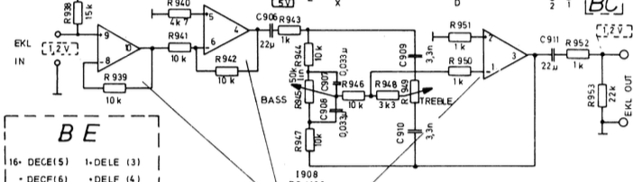

### Others

This board receives via the BE cable signals __DELE DELF DECE DECF__. Those are directly sent to the front panel left board (Effect board) via the jumper cables 3,4,5,6). DELE/DELF is connected to the Delay ms knob (a resistor is set depending on the position). DECE/DECLF is connected to the Decay ms knob (a resistor is set depending on the position).

## Effect board (Effektplatine 89007)

This board is the front panel left board and is connected to the display board via a set of jumper wires.

The BA connector sends and receives data from the filter board.

This board handles a few circuit parts that did not fit on the display board: delay 1 and 2 knobs, LEDs, Delay/Decay settings positions.

The Universal input on front panel goes through an opamp controled by the input volume kob (marked "volume" on the schematics). Then we go through an EQ section with another opamlp and the bass/treble knobs. This universal input is at the bottom left of the front panel.

The universal out (marked "mixed out) on the front panel comes directly from the BB connector (1/2).

From connector BA, inputs 4/5 ("vom filter") we receive the computed delay/echo.  
This signal goes through two potentiometers:

  - labeled "echo" on the diagram: the echo duration knob
  - labeled "duration" on the diagram: the delay duration knob

We find two relays, controled by the echo/reverb flags. Depending on the unit status, one of the knob value is ignored.
The signal (100% wet) then goes through a line driver opamp and is sent to:

  - Effect send via BB 8/9, thus to the back panel 
  - Filter ("zum filter") via BA 1/3

The "vom filter" signal algo goes through two potentiometers:
  - labeled "Return rev" on the diagram: the reverb "return" knob
  - labeled "return echo" on the diagram: the echo "return" knob

The reverb return value is again ignored depending on a relay controled by the reverb flag.
The delay return value goes through a __E KLIN__ - __E KLOUT__ before a similar relay.

The __EKLIN__/__EKLOUT__ is located on the "display board" (front panel, right) and is actually composed of the EQ section (the two bass/treble knobs at the right of the unit front panel).

Flows:

|  INPUT | OUTPUT | Process |
| ------- | ------ | ----- |
| Vom Filter (BA 4/5) | Zum filter (BA 1/3) | The signal is attenuated with the echo or reverb duration knobs, mixed with the actual dry signal (Eff send BB 8/9) and sent to filter. We continuously reinject the attenuated previous signal to the filter. |
| Vom Filter (BA 4/5) | Eff return (BB 6/7) | The signal is attenuated with the echo or reverb return knobs and sent to the carrier board. On delay mode, the EQ is applied. The "EFF ON/OFF" (16) is connected to the ground when the effect is disabled, nulling the output. The carrier board will generate the audio output signals from this one (mixed L/R/mono, delay L/R/mono). |

## Connectors

### BA

__From:__ Effect board (front panel left)
__To:__ Carrier board

  | Pin   | Usage             | From           | To           |
  | ----- | ----------------- | ------------- | ------------- |
  | 1     | GND (to filter)   | Effect board  | Carrier board |
  | 2     | NC                |               |               |
  | 3     | To filter         | Effect board  | Carrier board |
  | 4     | GND (from filter) | Carrier board | Effect board  |
  | 5     | From filter       | Carrier board | Effect board  |
  

### BB
  __From:__ Back panel
  __To:__  Effect board 

Back panel pinout:

  | Pin   | Usage                         | From          | To            |
  | ----- | ----------------------------- | ------------- | ------------- |
  | 1     | Effect send (merged from L/R) | Back panel    | Effect  board |
  | 2     | GND A                         | Back panel    | Effect  board |
  | 3     | Universal out                 | Effect  board | Effect  board |
  | 4     |                               | Effect  board | Effect  board |
  | 5     | Input (input mono)            | Back panel    | Effect  board |
  | 6     |                               | Effect  board | Effect  board |
  | 7     | Input (input mono) (GND A)    | Effect  board | Effect  board |
  | 8     | Effect return                 | Effect  board | Back panel    |
  | 9     | Effect return (GND A)         | Effect  board | Back panel    |

Effect panel pinout:

  | Pin   | Usage                         | From          | To            |
  | ----- | ----------------------------- | ------------- | ------------- |
  | 1     | GND A                         | Back panel    | Effect  board |
  | 2     | Universal out                 | Effect  board | Effect  board |
  | 3     |                               | Effect  board | Effect  board |
  | 4     | Input (input mono) (GND A)    | Effect  board | Effect  board |
  | 5     | Input (input mono)            | Back panel    | Effect  board |
  | 6     |                               | Effect  board | Effect  board |
  | 7     | Effect return                 | Effect  board | Back panel    |
  | 8     | Effect return (GND A)         | Effect  board | Back panel    |
  | 9     | Effect send (merged from L/R) | Back panel    | Effect  board |

The "BD" connector shown on the back panel schematics is actually "BB".

### BC

  __From:__ PSU
  __To:__ Display board

On the PSU:

  | Pin   | Usage   | From | To            | Color  |
  | ----- | ------- | ---- | ------------- | ------ |
  | 1     | +15V    | PSU  | Display board | white  |
  | 2     | GND A   | PSU  | Display board | brown  |
  | 3     | -15V    | PSU  | Display board | green  |
  | 4     | +5V     | PSU  | Display board | yellow |
  | 5     | GND D   | PSU  | Display board | grey   |
  | 6     | NC      | PSU  | Display board |        |
  

On the display board:

  | Pin   | Usage   | From | To            | Color  |
  | ----- | ------- | ---- | ------------- | ------ |
  | 1     | +15V    | PSU  | Display board | white  |
  | 2     | GND A   | PSU  | Display board | brown  |
  | 3     | -15V    | PSU  | Display board | green  |
  | 4     | NC      | PSU  | Display board |        |
  | 5     | +5V     | PSU  | Display board | yellow |
  | 6     | GND D   | PSU  | Display board | grey   |
  

### BD
  __From:__ Display panel
  __To:__  Carrier board 

  | Pin   | Usage                         | From          | To            |
  | ----- | ----------------------------- | ------------- | ------------- |
  | 1     | LED meter                     | Carrier board | Back panel    |
  | 2     | LED meter                     | Carrier board | Back panel    |
  | 3     | LED meter                     | Carrier board | Back panel    |
  | 4     | LED meter                     | Carrier board | Back panel    |
  | 5     | LED meter                     | Carrier board | Back panel    |
  | 6     | NC                            | NC            | NC            |
  | 7     | NC                            | NC            | NC            |
  | 8     | NC                            | NC            | NC            |
  | 9     | NC                            | NC            | NC            |
  | 10    | NC                            | NC            | NC            |
  | 11    | LED meter                     | Carrier board | Back panel    |
  | 12    | LED meter                     | Carrier board | Back panel    |
  | 13    | LED meter                     | Carrier board | Back panel    |
  | 14    | LED meter                     | Carrier board | Back panel    |
  | 15    | LED meter                     | Carrier board | Back panel    |
  | 16    | GND                           | Carrier board | Back panel    |

### BE

  __From:__ Carrier board
  __To:__ 

  | Pin   | Usage                                  | From          | To            |
  | ----- | -------------------------------------- | ------------- | ------------- |
  | 1     | DELE (Delay setting on effect board)   |               |               |
  | 2     | DELF (Delay setting on effect board) |               |               |
  | 3     | 320m (to multivibrator)                | Carrier board | Display board |
  | 4     | NC                                     |               |               |
  | 5     | NC                                     |               |               |
  | 6     | NC                                     |               |               |
  | 7     | REP (repeat mode bool)                 | Display board | Carrier board |
  | 8     | VCO (page 37 top right)                |               |               |
  | 9     | SYR (clock for MC14027B Flip Flop)     | Carrier board | Display board |
  | 10    | ERIMP (delay/rvb button trigger)       | Carrier board | Display board |
  | 11    | NC                                     |               |               |
  | 12    | NC                                     |               |               |
  | 13    | EREV (Delay/reverb mode boolean)       | Display board | Carrier board |
  | 14    | Konf (delay setting)                   | Display board | Carrier board |
  | 15    | DECF (Decay setting on effect board)   |               |               |
  | 16    | DECE (Decay setting on effect board)   |               |               |
  
### BF

  __From:__ PSU
  __To:__ Back panel circuit

  | Pin   | Usage   | From | To         |
  | ----- | ------- | ---- | ---------- |
  | 1     | +15V    | PSU  | Back panel |
  | 2     | GND A   | PSU  | Back panel |
  | 3     | -15V    | PSU  | Back panel |
  | 4     | NC      | PSU  | Back panel |
  

### BG

  __From:__ PSU
  __To:__ Carrier board

  | Pin   | Usage   | From | To            |
  | ----- | ------- | ---- | ------------- |
  | 1     | +15V    | PSU  | Carrier board |
  | 2     | GND A   | PSU  | Carrier board |
  | 3     | -15V    | PSU  | Carrier board |
  | 4     | NC      | PSU  | Carrier board |
  | 5     | +12V    | PSU  | Carrier board |
  | 6     | +5V     | PSU  | Carrier board |
  | 7     | +5V     | PSU  | Carrier board |
  | 8     | GND D   | PSU  | Carrier board |
  | 9     | GND D   | PSU  | Carrier board |
  | 10    | -5V     | PSU  | Carrier board |
  
  ## Lexicon

  | Name  | Description              |
  | ----- | ----------------------- |
  | REP     | Repeat mode flag                  |
  | EKL IN  | Audio signal sent to the main EQ |
  | EKL OUT | Audio signal returning from the main EQ |
  | DELE    | The Delay ms knob position (as a resistor value) |
  | DELF    | The Delay ms knob position (as a resistor value) |
  | DECE    | The Decay ms knob position (as a resistor value) |
  | DECF    | The Decay ms knob position (as a resistor value) |
  | EREV    | The Reverb/Delay mode flag |
  | EFF SEND | The dry signal coming from the back panel |
  | EFF RETURN | The wet signal returning to the back panel |
  | ERIMP | TODO: a fixed value clock?    |
  | 320m  | TODO: ERIMP clock stop flag?  |
  | KONF  | The clock signal configured with the delay time knob |
  | SYR   | TODO: a clock?  |
  | VCO   | TODO: ?  |